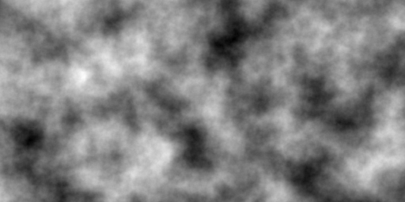
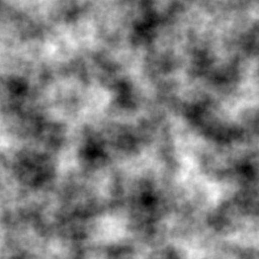
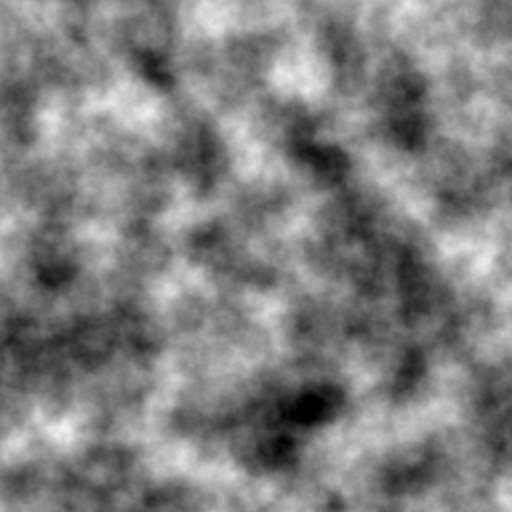

# siv::PerlinNoise


**siv::PerlinNoise** is a header-only Perlin noise library for modern C++ (C++17/20).  
The implementation is based on Ken Perlin's [Improved Noise](https://cs.nyu.edu/~perlin/noise/).

## Features
* 1D / 2D / 3D noise
* octave noise
* initial seed
* *(✨ new in v3.0)* produce the same output on any platform (except for floating point errors)

## License
siv::PerlinNoise is distributed under the **MIT license**.

## Usage

```cpp
# include <iostream>
# include "PerlinNoise.hpp"

int main()
{
	const siv::PerlinNoise::seed_type seed = 123456u;

	const siv::PerlinNoise perlin{ seed };
	
	for (int y = 0; y < 5; ++y)
	{
		for (int x = 0; x < 5; ++x)
		{
			const double noise = perlin.octave2D_01((x * 0.01), (y * 0.01), 4);
			
			std::cout << noise << '\t';
		}

		std::cout << '\n';
	}
}
```

## API

### `template <class Float> class BasicPerlinNoise`

- Typedefs
  - `using PerlinNoise = BasicPerlinNoise<double>;`
  - `using state_type = std::array<std::uint8_t, 256>;`
  - `using value_type = Float;`
  - `using default_random_engine = std::mt19937;`
  - `using seed_type = typename default_random_engine::result_type;`
- Constructors
  - `constexpr BasicPerlinNoise();`
  - `BasicPerlinNoise(seed_type seed);`
  - `BasicPerlinNoise(URBG&& urbg);`
- Reseed
  - `void reseed(seed_type seed);`
  - `void reseed(URBG&& urbg);`
- Serialization
  - `constexpr const state_type& serialize() const noexcept;`
  - `constexpr void deserialize(const state_type& state) noexcept;`
- Noise (The result is **in the range [-1, 1]**)
  - `value_type noise1D(value_type x) const noexcept;`
  - `value_type noise2D(value_type x, value_type y) const noexcept;`
  - `value_type noise3D(value_type x, value_type y, value_type z) const noexcept;`
- Noise (The result is **remapped to the range [0, 1]**)
  - `value_type noise1D_01(value_type x) const noexcept;`
  - `value_type noise2D_01(value_type x, value_type y) const noexcept;`
  - `value_type noise3D_01(value_type x, value_type y, value_type z) const noexcept;`
- Octave noise (The result **can be out of the range [-1, 1]**)
  - `value_type octave1D(value_type x, std::int32_t octaves, value_type persistence = value_type(0.5)) const noexcept;`
  - `value_type octave2D(value_type x, value_type y, std::int32_t octaves, value_type persistence = value_type(0.5)) const noexcept;`
  - `value_type octave3D(value_type x, value_type y, value_type z, std::int32_t octaves, value_type persistence = value_type(0.5)) const noexcept;`
- Octave noise (The result is **clamped to the range [-1, 1]**)
  - `value_type octave1D_11(value_type x, std::int32_t octaves, value_type persistence = value_type(0.5)) const noexcept;`
  - `value_type octave2D_11(value_type x, value_type y, std::int32_t octaves, value_type persistence = value_type(0.5)) const noexcept;`
  - `value_type octave3D_11(value_type x, value_type y, value_type z, std::int32_t octaves, value_type persistence = value_type(0.5)) const noexcept;`
- Octave noise (The result is **clamped and remapped to the range [0, 1]**)
  - `value_type octave1D_01(value_type x, std::int32_t octaves, value_type persistence = value_type(0.5)) const noexcept;`
  - `value_type octave2D_01(value_type x, value_type y, std::int32_t octaves, value_type persistence = value_type(0.5)) const noexcept;`
  - `value_type octave3D_01(value_type x, value_type y, value_type z, std::int32_t octaves, value_type persistence = value_type(0.5)) const noexcept;`
- Octave noise (The result is **normalized to the range [-1, 1]**)
  - `value_type normalizedOctave1D(value_type x, std::int32_t octaves, value_type persistence = value_type(0.5)) const noexcept;`
  - `value_type normalizedOctave2D(value_type x, value_type y, std::int32_t octaves, value_type persistence = value_type(0.5)) const noexcept;`
  - `value_type normalizedOctave3D(value_type x, value_type y, value_type z, std::int32_t octaves, value_type persistence = value_type(0.5)) const noexcept;`
- Octave noise (The result is **normalized and remapped to the range [0, 1]**)
  - `value_type normalizedOctave1D_01(value_type x, std::int32_t octaves, value_type persistence = value_type(0.5)) const noexcept;`
  - `value_type normalizedOctave2D_01(value_type x, value_type y, std::int32_t octaves, value_type persistence = value_type(0.5)) const noexcept;`
  - `value_type normalizedOctave3D_01(value_type x, value_type y, value_type z, std::int32_t octaves, value_type persistence = value_type(0.5)) const noexcept;`

## Example
Run example.cpp with the following parameters.

```
frequency = 8.0
octaves = 8
seed = 12345
```



---

```
frequency = 8.0
octaves = 8
seed = 23456
```



---

```
frequency = 8.0
octaves = 3
seed = 23456
```


