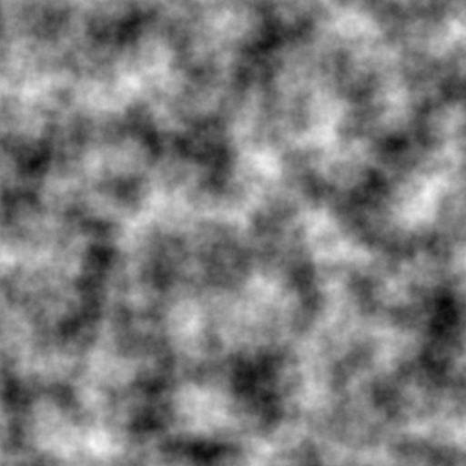

# siv::PerlinNoise
**siv::PerlinNoise** is a Perlin noise library for modern C++.  
Based on Ken Perlin's [ImprovedNoise](<http://mrl.nyu.edu/~perlin/noise/>).

## Features
* random seed
* 1D/2D/3D noise
* octave noise
* [0.0, 1.0] noise

## Examples
Run Test_PerlinNoise.cpp with the following parameters.
```
* frequency = 8.0
* octaves = 8
* seed = 12345
```



## License
siv::PerlinNoise is distributed under the MIT license.
